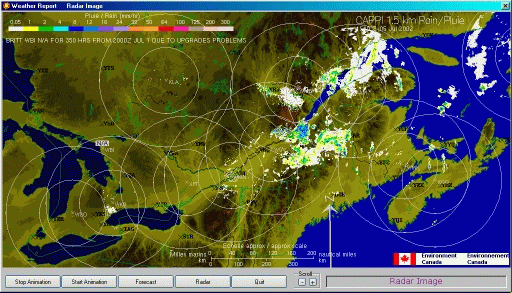



## MeteoForeCast

### Description

Pardon for my poor english...

With this new complete program of weather report, you will have by the fact a control of gif animation and a xpStyle button. Already very popular, the AnimGif ocx worth several good votes... For the weather map which is maybe not from your zone,just copy the address of your sector and afterward modify the program in consequence. Thank you in advance for your numerous votes and do not hesitate to contact me for infos or constructive criticisms...
 
### More Info
 

             |
---                |---
**Submitted On**   |2002-07-05 15:27:12
**By**             |[Les Productions UnderDog](https://github.com/Planet-Source-Code/PSCIndex/blob/master/ByAuthor/les-productions-underdog.md)
**Level**          |Advanced
**User Rating**    |4.0 (52 globes from 13 users)
**Compatibility**  |VB 4\.0 \(32\-bit\), VB 5\.0, VB 6\.0
**Category**       |[Complete Applications](https://github.com/Planet-Source-Code/PSCIndex/blob/master/ByCategory/complete-applications__1-27.md)
**World**          |[Visual Basic](https://github.com/Planet-Source-Code/PSCIndex/blob/master/ByWorld/visual-basic.md)
**Archive File**   |[MeteoForeC102501752002\.zip](https://github.com/Planet-Source-Code/les-productions-underdog-meteoforecast__1-36616/archive/master.zip)

